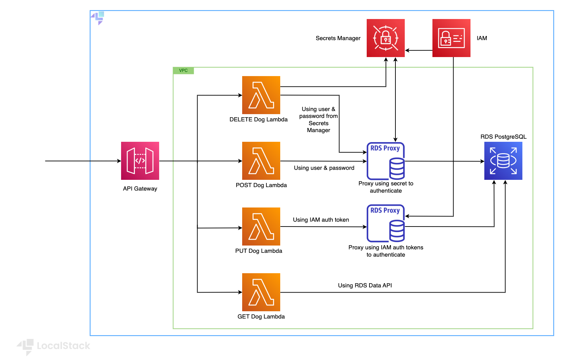

# Authentication to RDS PostgreSQL with RDS Proxy/Secrets Manager/IAM Auth token from AWS Lambda
# Dog Management Application

This application provides a set of AWS Lambda functions to manage dog records, including creating, updating, retrieving, and deleting dog information. The application uses AWS API Gateway to expose these Lambda functions as HTTP endpoints.



## Prerequisites

- Java 21 (21.0.2-amzn)
- Apache Maven (3.9.9)
- AWS CLI & AWS CLI Local (aws-cli/1.33.44)
- Terraform & [terraform-local](https://github.com/localstack/terraform-local) 
- LocalStack CLI & Pro image (4.0.3)

## Project Structure

- `terraform/`: Contains Terraform configuration files for deploying the infrastructure.
- `get-dog-lambda/`: Contains the source code and build files for the `get-dog` Lambda function.
- `put-dog-lambda/`: Contains the source code and build files for the `put-dog` Lambda function.
- `delete-dog-lambda/`: Contains the source code and build files for the `delete-dog` Lambda function.
- `db-setup-lambda/`: Contains the source code and build files for the `db-setup` Lambda function.

## Setup

1.**Build Lambdas & install dependencies:**

Ensure you have Java 21 and Maven installed. Then, build the Lambda functions:

```sh
    cd api-lambdas
    mvn clean package
```
*Enjoy some elevator music while the build completes.*

2. **Start LocalStack:**

```sh
    DEBUG=1 localstack start
```

3. **Deploy the infrastructure:**

Navigate to the `terraform` directory and apply the Terraform configuration:

```sh
    cd terraform
    tflocal init
    tflocal apply --auto-approve
 ```

4. **Initialize the database:**

Invoke the `db-setup` Lambda function to create the `dogs` table in the RDS PostgreSQL database:

```sh
    awslocal lambda invoke --function-name db-setup --region us-east-1 output.json
```

## Usage
At the end of the setup, you will see the API Gateway endpoint URL in the Terraform output.
The application exposes the following API endpoints:

- **GET /dogs/{id}**: Retrieves a dog record by ID.
- **PUT /dogs**: Updates a dog record.
- **POST /dogs**: Creates a dog record.
- **DELETE /dogs/{id}**: Delete a dog record by ID.

You can use tools like `curl` or Postman to interact with these endpoints.

## Environment Variables

The Lambda functions use the following environment variables:

- `SECRET_ARN`: ARN of the AWS Secrets Manager secret.
- `DATABASE_NAME`: Name of the database.
- `DB_CLUSTER_ARN`: ARN of the RDS cluster.
- `HOST`: Endpoint of the RDS proxy.
- `AWS_REGION`: AWS region.

**Note:**
If any of these environment variables are not set, please run `tflocal apply --auto-approve`. 
This can happen when the Lambda functions are deployed before the cluster is ready.
You should see the following, whivh indicates that the environment variables have been set:
```sh
    Apply complete! Resources: 0 added, 6 changed, 0 destroyed.
```

## Cleanup

To clean up the resources created by Terraform, run:

```sh
terraform destroy
```

## Testing endpoints

Remember to replace the endpoint with the one you got from the Terraform output.

1. Add a dog record:

```sh
curl --location 'http://24d810fe.execute-api.localhost.localstack.cloud:4566/dev/dogs' \
--header 'Content-Type: application/json' \
--data '{
    "name":"Pipa",
    "age":"1",
    "category":"Pupper"
}'
```

2. Update a dog record:

```sh
curl --location --request PUT 'http://24d810fe.execute-api.localhost.localstack.cloud:4566/dev/dogs' \
--header 'Content-Type: application/json' \
--data '{
    "id":"3",
    "name":"Pipa",
    "age":"2",
    "category":"Woofer"
}'
```
 You can connect to the database using the following command, using `psql`:

```shell
PGPASSWORD=supersecurepassword psql -d dogs -U lambda_user -w -p 4510 -h localhost.localstack.cloud
```
```shell
dogs=# SELECT * FROM dogs;
 id | name  | age | category 
----+-------+-----+----------
  1 | Buddy |   3 | Yipper
  2 | John  |   4 | Boofer
  3 | Pipa  |   2 | Woofer
(3 rows)

```

3. Retrieve a dog record:

```sh
curl --location 'http://24d810fe.execute-api.localhost.localstack.cloud:4566/dev/dogs/1'

{"name":"Buddy","id":1,"category":"Yipper","age":3}
```


4. Delete a dog record (they go home):

```sh
curl --location --request DELETE 'http://24d810fe.execute-api.localhost.localstack.cloud:4566/dev/dogs/1'

Dog deleted successfully!
```